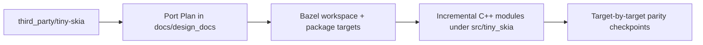

# Design: Tiny-Skia C++ Port Bootstrap

**Status:** Design
**Author:** Codex
**Created:** 2026-02-13

## Summary
- Create the first-stage scaffolding for a line-by-line, bit-accurate C++20 port of Rust tiny-skia.
- The initial goal is to establish a Bazel-first workspace and directory structure before any C++ translation starts.
- This design gates implementation sequencing and keeps the migration deterministic and auditable.

## Steering Decisions
- Always run `bazel build //...` after each functional porting step.
- Add/extend C++ tests during porting and validate with `bazel test //...`.
- All tests in this repo must be written with Google Test + Google Mock (`gtest`/`gmock`),
  including parity tests in `tests/`.
- Add image-regression gates with pixel-diff tests (pixelmatch-cpp) when rendering
  outputs are available for C++ parity runs.
- After user review/approval to proceed, commit current changes before any further
  implementation edits.

## Goals
- Set up a Bazel build system and top-level project layout usable from day one.
- Keep repository layout optimized for incremental porting and easy parity validation.
- Make `third_party/tiny-skia` available in-repo for reference.
- Keep decisions explicit in design docs so later phases can proceed milestone by milestone.

## Non-Goals
- No rendering behavior will be changed yet.
- No C++ implementation of tiny-skia modules is included in this phase.
- No strict performance tuning in this initial setup.
- No test harness parity with tiny-skia test suites yet.

## Next Steps
- Create the Bazel workspace/build skeleton and placeholder targets.
- Add a bootstrap design doc and keep it as the process gate for next implementation tasks.
- Add a project directory layout aligned with bit-accurate porting stages.

## Implementation Plan

### Milestone 0: Alignment and ownership
- [x] Confirm canonical conventions:
  - Bzlmod-first build (`MODULE.bazel` ownership, no `WORKSPACE` runtime dependency).
  - Bazel-native layout with no top-level `include/` directory.
  - Library source and headers in `src/tiny_skia/`.
  - Consumer include root is `tiny_skia` (`#include <tiny_skia/Filename.h>`).
- [x] Define file naming and visibility contract:
  - Public header path: `src/tiny_skia/<UpperCamel>.h`.
  - Public source path: `src/tiny_skia/<UpperCamel>.cpp`.
  - Private package includes remain in-tree, no split include tree.
- [x] Record build and porting risk policy in this design doc.
- [x] Add this design doc section as the gating checkpoint before every module handoff.

### Milestone 1: Build and repository bootstrap (required before functional ports)
- [x] Verify `MODULE.bazel` captures core external toolchain dependencies.
- [🟡] Finalize `BUILD.bazel` stubs in `src/`, `tests/`, and nested modules.
- [🟡] Finalize `bazel/defs.bzl` macro API and document call patterns.
- [x] Add baseline test target(s) for build smoke checks.
- [x] Add Bazel outputs and `MODULE.bazel.lock` to `.gitignore`.
- [x] Ensure `bazel build //...` is green before/through translation steps.

### Milestone 2: Rust reference indexing
- [x] Validate that all Rust files from `third_party/tiny-skia/src` are indexed in the tracker table.
- [🟡] For each Rust file, record symbol ownership, dependencies, and visibility assumptions.
- [ ] Mark dependencies between modules in the tracker before code starts moving.
- [ ] Identify hard equivalence anchors (golden vectors, float semantics, bit-level ops).
- [ ] Resolve any module-order blockers by dependency DAG before porting.

### Milestone 3: Translation workflow lock
- [🟡] For each Rust file:
  - Add row to the file-level function table with `Rust function/item` / `C++ function/item`.
  - Add status and equivalence check entry for every function.
- [ ] Port in deterministic order: foundations → geometry/path64 → scan/pipeline → shading.
- [x] Keep headers and sources colocated under `src/tiny_skia` and update BUILD deps as you go.
- [x] Compile every partially done file through incremental builds.

### Milestone 4: Function-by-function porting execution
- [🟡] For each function:
  - Translate signature and types preserving semantics and error behavior.
  - Port constants, helper invariants, and edge-case branches first.
  - Add C++ unit or property tests with strict equality or documented epsilon tolerance.
  - Add a gtest parity test against Rust-derived behavior for each function when feasible.
  - Update tracker status from `☐` to `🟡` then `✅`.
- [ ] For each file, mark blocked status `⏸` with explicit reason if unresolved.
- [🟡] If Rust tests are missing for a function, add equivalent C++ coverage first.

### Milestone 5: Validation and release gates
- [🟡] Update port tracker and function tables after each file is fully ported.
- [ ] Keep per-file completion criteria:
  - File-level build success.
  - All declared functions have status and test evidence.
- [🟡] Add module integration tests for public API seams once adjacent files are complete.
- [x] Require a clean `bazel build //...` as a gate before moving to next milestone.

## Proposed Architecture
- A thin monorepo-style topology:
  - `third_party/tiny-skia` holds canonical Rust source for reference only.
  - `src/tiny_skia/` holds C++ source and headers, colocated per module.
  - `bazel/` holds shared Bazel macros and eventual repository helpers.
- Bazel will be the primary build driver, with targets structured so each module can be ported and validated in isolation.

### Data Flow for This Phase
- Inputs: Rust reference source in `third_party/tiny-skia`.
- Tooling: Bazel reads package files under `src/tiny_skia/` and `tests/`.
- Outputs: Buildable package graph and reproducible module checkpoints for next implementation milestones.

## Testing and Validation
- Primary validation is build and behavioral parity checks through gtest/gmock:
  - Confirm `bazel build //...`.
  - Confirm `bazel test //...`.
  - Confirm parity tests exist for each function-level implementation that is ported.
- In bootstrap, ensure `MODULE.bazel` and package BUILD files are syntactically present.
- Confirm `MODULE.bazel` and package BUILD files are syntactically present.
- Confirm `third_party/tiny-skia` is checked in locally.
- Confirm design doc gate remains updated before implementation work continues.

## Porting Tracker (Rust file → C++ file)

Legend: `✅` Ported, `🟡` In progress, `⏸` Blocked, `☐` Not started.

| Old Rust file | New C++ file | Status |
| --- | --- | --- |
| `third_party/tiny-skia/src/lib.rs` | `src/tiny_skia/Lib.cpp` + `src/tiny_skia/Lib.h` | ✅ |
| `third_party/tiny-skia/src/alpha_runs.rs` | `src/tiny_skia/AlphaRuns.cpp` + `src/tiny_skia/AlphaRuns.h` | ✅ |
| `third_party/tiny-skia/src/blend_mode.rs` | `src/tiny_skia/BlendMode.cpp` + `src/tiny_skia/BlendMode.h` | ✅ |
| `third_party/tiny-skia/src/blitter.rs` | `src/tiny_skia/Blitter.cpp` + `src/tiny_skia/Blitter.h` | ✅ |
| `third_party/tiny-skia/src/color.rs` | `src/tiny_skia/Color.cpp` + `src/tiny_skia/Color.h` | ✅ |
| `third_party/tiny-skia/src/edge.rs` | `src/tiny_skia/Edge.cpp` + `src/tiny_skia/Edge.h` | ✅ |
| `third_party/tiny-skia/src/edge_builder.rs` | `src/tiny_skia/EdgeBuilder.cpp` + `src/tiny_skia/EdgeBuilder.h` | ☐ |
| `third_party/tiny-skia/src/edge_clipper.rs` | `src/tiny_skia/EdgeClipper.cpp` + `src/tiny_skia/EdgeClipper.h` | ☐ |
| `third_party/tiny-skia/src/fixed_point.rs` | `src/tiny_skia/FixedPoint.cpp` + `src/tiny_skia/FixedPoint.h` | ✅ |
| `third_party/tiny-skia/src/geom.rs` | `src/tiny_skia/Geom.cpp` + `src/tiny_skia/Geom.h` | ✅ |
| `third_party/tiny-skia/src/line_clipper.rs` | `src/tiny_skia/LineClipper.cpp` + `src/tiny_skia/LineClipper.h` | ✅ |
| `third_party/tiny-skia/src/math.rs` | `src/tiny_skia/Math.cpp` + `src/tiny_skia/Math.h` | ✅ |
| `third_party/tiny-skia/src/mask.rs` | `src/tiny_skia/Mask.cpp` + `src/tiny_skia/Mask.h` | ☐ |
| `third_party/tiny-skia/src/path_geometry.rs` | `src/tiny_skia/PathGeometry.cpp` + `src/tiny_skia/PathGeometry.h` | ☐ |
| `third_party/tiny-skia/src/painter.rs` | `src/tiny_skia/Painter.cpp` + `src/tiny_skia/Painter.h` | ☐ |
| `third_party/tiny-skia/src/pixmap.rs` | `src/tiny_skia/Pixmap.cpp` + `src/tiny_skia/Pixmap.h` | ☐ |
| `third_party/tiny-skia/src/pipeline/blitter.rs` | `src/tiny_skia/pipeline/Blitter.cpp` + `src/tiny_skia/pipeline/Blitter.h` | ☐ |
| `third_party/tiny-skia/src/pipeline/highp.rs` | `src/tiny_skia/pipeline/Highp.cpp` + `src/tiny_skia/pipeline/Highp.h` | ☐ |
| `third_party/tiny-skia/src/pipeline/lowp.rs` | `src/tiny_skia/pipeline/Lowp.cpp` + `src/tiny_skia/pipeline/Lowp.h` | ☐ |
| `third_party/tiny-skia/src/pipeline/mod.rs` | `src/tiny_skia/pipeline/Mod.cpp` + `src/tiny_skia/pipeline/Mod.h` | ☐ |
| `third_party/tiny-skia/src/scan/hairline.rs` | `src/tiny_skia/scan/Hairline.cpp` + `src/tiny_skia/scan/Hairline.h` | ☐ |
| `third_party/tiny-skia/src/scan/hairline_aa.rs` | `src/tiny_skia/scan/HairlineAa.cpp` + `src/tiny_skia/scan/HairlineAa.h` | ☐ |
| `third_party/tiny-skia/src/scan/mod.rs` | `src/tiny_skia/scan/Mod.cpp` + `src/tiny_skia/scan/Mod.h` | ☐ |
| `third_party/tiny-skia/src/scan/path.rs` | `src/tiny_skia/scan/Path.cpp` + `src/tiny_skia/scan/Path.h` | ☐ |
| `third_party/tiny-skia/src/scan/path_aa.rs` | `src/tiny_skia/scan/PathAa.cpp` + `src/tiny_skia/scan/PathAa.h` | ☐ |
| `third_party/tiny-skia/src/path64/cubic64.rs` | `src/tiny_skia/path64/Cubic64.cpp` + `src/tiny_skia/path64/Cubic64.h` | 🟡 |
| `third_party/tiny-skia/src/path64/line_cubic_intersections.rs` | `src/tiny_skia/path64/LineCubicIntersections.cpp` + `src/tiny_skia/path64/LineCubicIntersections.h` | ☐ |
| `third_party/tiny-skia/src/path64/mod.rs` | `src/tiny_skia/path64/Mod.cpp` + `src/tiny_skia/path64/Mod.h` | ✅ |
| `third_party/tiny-skia/src/path64/point64.rs` | `src/tiny_skia/path64/Point64.cpp` + `src/tiny_skia/path64/Point64.h` | ✅ |
| `third_party/tiny-skia/src/path64/quad64.rs` | `src/tiny_skia/path64/Quad64.cpp` + `src/tiny_skia/path64/Quad64.h` | ✅ |
| `third_party/tiny-skia/src/shaders/gradient.rs` | `src/tiny_skia/shaders/Gradient.cpp` + `src/tiny_skia/shaders/Gradient.h` | ☐ |
| `third_party/tiny-skia/src/shaders/linear_gradient.rs` | `src/tiny_skia/shaders/LinearGradient.cpp` + `src/tiny_skia/shaders/LinearGradient.h` | ☐ |
| `third_party/tiny-skia/src/shaders/mod.rs` | `src/tiny_skia/shaders/Mod.cpp` + `src/tiny_skia/shaders/Mod.h` | ☐ |
| `third_party/tiny-skia/src/shaders/pattern.rs` | `src/tiny_skia/shaders/Pattern.cpp` + `src/tiny_skia/shaders/Pattern.h` | ☐ |
| `third_party/tiny-skia/src/shaders/radial_gradient.rs` | `src/tiny_skia/shaders/RadialGradient.cpp` + `src/tiny_skia/shaders/RadialGradient.h` | ☐ |
| `third_party/tiny-skia/src/shaders/sweep_gradient.rs` | `src/tiny_skia/shaders/SweepGradient.cpp` + `src/tiny_skia/shaders/SweepGradient.h` | ☐ |
| `third_party/tiny-skia/src/wide/f32x16_t.rs` | `src/tiny_skia/wide/F32x16T.cpp` + `src/tiny_skia/wide/F32x16T.h` | ☐ |
| `third_party/tiny-skia/src/wide/f32x4_t.rs` | `src/tiny_skia/wide/F32x4T.cpp` + `src/tiny_skia/wide/F32x4T.h` | ☐ |
| `third_party/tiny-skia/src/wide/f32x8_t.rs` | `src/tiny_skia/wide/F32x8T.cpp` + `src/tiny_skia/wide/F32x8T.h` | ☐ |
| `third_party/tiny-skia/src/wide/i32x4_t.rs` | `src/tiny_skia/wide/I32x4T.cpp` + `src/tiny_skia/wide/I32x4T.h` | ☐ |
| `third_party/tiny-skia/src/wide/i32x8_t.rs` | `src/tiny_skia/wide/I32x8T.cpp` + `src/tiny_skia/wide/I32x8T.h` | ☐ |
| `third_party/tiny-skia/src/wide/mod.rs` | `src/tiny_skia/wide/Mod.cpp` + `src/tiny_skia/wide/Mod.h` | ☐ |
| `third_party/tiny-skia/src/wide/u16x16_t.rs` | `src/tiny_skia/wide/U16x16T.cpp` + `src/tiny_skia/wide/U16x16T.h` | ☐ |
| `third_party/tiny-skia/src/wide/u32x4_t.rs` | `src/tiny_skia/wide/U32x4T.cpp` + `src/tiny_skia/wide/U32x4T.h` | ☐ |
| `third_party/tiny-skia/src/wide/u32x8_t.rs` | `src/tiny_skia/wide/U32x8T.cpp` + `src/tiny_skia/wide/U32x8T.h` | ☐ |

### Naming rule
- `snake_case.rs` -> `UpperCamel.cpp` and `UpperCamel.h`
- `mod.rs` -> `Mod.cpp` and `Mod.h`
- C++ function names are lowerCamelCase.

## Function Mapping Tables

When a file is actively being ported, add a table under this section.

### `third_party/tiny-skia/src/lib.rs`
| Rust function/item | C++ function/item | Status | Equivalence checks |
| --- | --- | --- | --- |
| `k_library_version` | `kLibraryVersion` | ✅ | Constant value parity |
| `library_version` | `libraryVersion` | ✅ | Exact return value parity |

### `third_party/tiny-skia/src/alpha_runs.rs`
| Rust function/item | C++ function/item | Status | Equivalence checks |
| --- | --- | --- | --- |
| `AlphaRuns::new` | `AlphaRuns::AlphaRuns` | ✅ | Unit-equivalent construction invariants |
| `AlphaRuns::catch_overflow` | `AlphaRuns::catchOverflow` | ✅ | Manual checks with `0`, `1`, `255`, `256` |
| `AlphaRuns::is_empty` | `AlphaRuns::isEmpty` | ✅ | Smoke tests for empty and non-empty states |
| `AlphaRuns::reset` | `AlphaRuns::reset` | ✅ | Reset re-initializes state at width boundary |
| `AlphaRuns::add` | `AlphaRuns::add` | ✅ | Manual parity vectors vs Rust reference |
| `AlphaRuns::break_run` | `AlphaRuns::breakRun` | ✅ | Manual parity vectors vs Rust reference |
| `AlphaRuns::break_at` | `AlphaRuns::breakAt` | ✅ | Manual parity vectors vs Rust reference |

### `third_party/tiny-skia/src/blend_mode.rs`
| Rust function/item | C++ function/item | Status | Equivalence checks |
| --- | --- | --- | --- |
| `BlendMode::should_pre_scale_coverage` | `shouldPreScaleCoverage` | ✅ | Branch coverage across positive and negative classes |
| `BlendMode::to_stage` | `toStage` | ✅ | Full stage mapping coverage |

### `third_party/tiny-skia/src/fixed_point.rs`
| Rust function/item | C++ function/item | Status | Equivalence checks |
| --- | --- | --- | --- |
| `fdot6::from_i32` | `fdot6::fromI32` | ✅ | Scalar value checks around unit conversions |
| `fdot6::from_f32` | `fdot6::fromF32` | ✅ | Scalar value checks around fixed-point conversion |
| `fdot6::floor` | `fdot6::floor` | ✅ | Value boundary checks |
| `fdot6::ceil` | `fdot6::ceil` | ✅ | Value boundary checks |
| `fdot6::round` | `fdot6::round` | ✅ | Value boundary checks |
| `fdot6::to_fdot16` | `fdot6::toFdot16` | ✅ | Internal bit-shift consistency |
| `fdot6::div` | `fdot6::div` | ✅ | Integer division parity cases |
| `fdot6::can_convert_to_fdot16` | `fdot6::canConvertToFdot16` | ✅ | Magnitude boundary checks |
| `fdot6::small_scale` | `fdot6::smallScale` | ✅ | Scale boundary checks |
| `fdot8::from_fdot16` | `fdot8::fromFdot16` | ✅ | Scalar parity checks |
| `fdot16::from_f32` | `fdot16::fromF32` | ✅ | Saturation and conversion sanity checks |
| `fdot16::floor_to_i32` | `fdot16::floorToI32` | ✅ | Value boundary checks |
| `fdot16::ceil_to_i32` | `fdot16::ceilToI32` | ✅ | Value boundary checks |
| `fdot16::round_to_i32` | `fdot16::roundToI32` | ✅ | Value boundary checks |
| `fdot16::mul` | `fdot16::mul` | ✅ | Scale invariants |
| `fdot16::div` | `fdot16::divide` | ✅ | Value parity checks |
| `fdot16::fast_div` | `fdot16::fastDiv` | ✅ | Shift/branch parity checks |

### `third_party/tiny-skia/src/color.rs`
| Rust function/item | C++ function/item | Status | Equivalence checks |
| --- | --- | --- | --- |
| `ColorU8::from_rgba` | `ColorU8::fromRgba` | ✅ | Constructor and field-equality checks |
| `ColorU8::red` | `ColorU8::red` | ✅ | Component assertions |
| `ColorU8::green` | `ColorU8::green` | ✅ | Component assertions |
| `ColorU8::blue` | `ColorU8::blue` | ✅ | Component assertions |
| `ColorU8::alpha` | `ColorU8::alpha` | ✅ | Component assertions |
| `ColorU8::is_opaque` | `ColorU8::isOpaque` | ✅ | Opaque/non-opaque checks |
| `ColorU8::premultiply` | `ColorU8::premultiply` | ✅ | Integer-channel demotion/equality checks |
| `PremultipliedColorU8::from_rgba` | `PremultipliedColorU8::fromRgba` | ✅ | `red <= alpha` validation checks |
| `PremultipliedColorU8::from_rgba_unchecked` | `PremultipliedColorU8::fromRgbaUnchecked` | ✅ | Structural assertions |
| `PremultipliedColorU8::red` | `PremultipliedColorU8::red` | ✅ | Component assertions |
| `PremultipliedColorU8::green` | `PremultipliedColorU8::green` | ✅ | Component assertions |
| `PremultipliedColorU8::blue` | `PremultipliedColorU8::blue` | ✅ | Component assertions |
| `PremultipliedColorU8::alpha` | `PremultipliedColorU8::alpha` | ✅ | Component assertions |
| `PremultipliedColorU8::is_opaque` | `PremultipliedColorU8::isOpaque` | ✅ | Boundary checks |
| `PremultipliedColorU8::demultiply` | `PremultipliedColorU8::demultiply` | ✅ | Roundtrip + special-case checks |
| `Color::from_rgba_unchecked` | `Color::fromRgbaUnchecked` | ✅ | Constant conversion checks |
| `Color::from_rgba` | `Color::fromRgba` | ✅ | Optional validity + range reject checks |
| `Color::from_rgba8` | `Color::fromRgba8` | ✅ | 8-bit quantization checks |
| `Color::red` | `Color::red` | ✅ | Component assertions |
| `Color::green` | `Color::green` | ✅ | Component assertions |
| `Color::blue` | `Color::blue` | ✅ | Component assertions |
| `Color::alpha` | `Color::alpha` | ✅ | Component assertions |
| `Color::set_red` | `Color::setRed` | ✅ | Clamp semantics check |
| `Color::set_green` | `Color::setGreen` | ✅ | Clamp semantics check |
| `Color::set_blue` | `Color::setBlue` | ✅ | Clamp semantics check |
| `Color::set_alpha` | `Color::setAlpha` | ✅ | Clamp semantics check |
| `Color::apply_opacity` | `Color::applyOpacity` | ✅ | Opacity clamp and multiplication check |
| `Color::is_opaque` | `Color::isOpaque` | ✅ | Opacity boundary check |
| `Color::premultiply` | `Color::premultiply` | ✅ | Premultiply and demultiply roundtrip checks |
| `Color::to_color_u8` | `Color::toColorU8` | ✅ | Channel quantization checks |
| `PremultipliedColor::red` | `PremultipliedColor::red` | ✅ | Component assertions |
| `PremultipliedColor::green` | `PremultipliedColor::green` | ✅ | Component assertions |
| `PremultipliedColor::blue` | `PremultipliedColor::blue` | ✅ | Component assertions |
| `PremultipliedColor::alpha` | `PremultipliedColor::alpha` | ✅ | Component assertions |
| `PremultipliedColor::demultiply` | `PremultipliedColor::demultiply` | ✅ | Alpha zero / normal-case checks |
| `PremultipliedColor::to_color_u8` | `PremultipliedColor::toColorU8` | ✅ | Channel quantization checks |
| `premultiply_u8` | `premultiplyU8` | ✅ | Fixed-point rounding checks |
| `color_f32_to_u8` | `colorF32ToU8` | ✅ | Quantization parity checks |
| `ColorSpace::expand_channel` | `expandChannel` | ✅ | Transform checkpoints for all modes |
| `ColorSpace::expand_color` | `expandColor` | ✅ | Channel-wise transform check |
| `ColorSpace::compress_channel` | `compressChannel` | ✅ | Transform checkpoints |
| `ColorSpace::expand_stage` | `expandStage` | ✅ | Option mapping check |
| `ColorSpace::expand_dest_stage` | `expandDestStage` | ✅ | Option mapping check |
| `ColorSpace::compress_stage` | `compressStage` | ✅ | Option mapping check |

### `third_party/tiny-skia/src/math.rs`
| Rust function/item | C++ function/item | Status | Equivalence checks |
| --- | --- | --- | --- |
| `bound` | `bound` | ✅ | Compare against min, max, and mid-interval samples |
| `left_shift` | `leftShift` | ✅ | Bit-equality for positive and negative inputs |
| `left_shift64` | `leftShift64` | ✅ | Bit-equality for positive and negative inputs |
| `approx_powf` | `approxPowf` | ✅ | Compare against Rust reference at canonical power pairs |

### `third_party/tiny-skia/src/geom.rs`
| Rust function/item | C++ function/item | Status | Equivalence checks |
| --- | --- | --- | --- |
| `ScreenIntRect::from_xywh` | `ScreenIntRect::fromXYWH` | ✅ | Boundary checks and overflow invariants |
| `ScreenIntRect::from_xywh_safe` | `ScreenIntRect::fromXYWHSafe` | ✅ | Constructor sanity smoke tests |
| `ScreenIntRect::x` | `ScreenIntRect::x` | ✅ | Coordinate round-trip checks |
| `ScreenIntRect::y` | `ScreenIntRect::y` | ✅ | Coordinate round-trip checks |
| `ScreenIntRect::width` | `ScreenIntRect::width` | ✅ | Width read/write boundary tests |
| `ScreenIntRect::height` | `ScreenIntRect::height` | ✅ | Height read/write boundary tests |
| `ScreenIntRect::width_safe` | `ScreenIntRect::widthSafe` | ✅ | Width safety checks |
| `ScreenIntRect::left` | `ScreenIntRect::left` | ✅ | Coordinate round-trip checks |
| `ScreenIntRect::top` | `ScreenIntRect::top` | ✅ | Coordinate round-trip checks |
| `ScreenIntRect::right` | `ScreenIntRect::right` | ✅ | Overflow guard checks |
| `ScreenIntRect::bottom` | `ScreenIntRect::bottom` | ✅ | Overflow guard checks |
| `ScreenIntRect::size` | `ScreenIntRect::size` | ✅ | Size extraction invariants |
| `ScreenIntRect::contains` | `ScreenIntRect::contains` | ✅ | Containment property checks |
| `ScreenIntRect::to_int_rect` | `ScreenIntRect::toIntRect` | ✅ | Struct conversion invariants |
| `ScreenIntRect::to_rect` | `ScreenIntRect::toRect` | ✅ | Float conversion parity |
| `IntSizeExt::to_screen_int_rect` | `IntSize::toScreenIntRect` | ✅ | Positioned rectangle smoke tests |
| `IntSize::from_wh` | `IntSize::fromWh` | ✅ | Reject zero dimensions |
| `IntRect::from_xywh` | `IntRect::fromXYWH` | ✅ | Bounds and overflow checks |
| `IntRect::width` | `IntRect::width` | ✅ | Width read/write checks |
| `IntRect::height` | `IntRect::height` | ✅ | Height read/write checks |
| `IntRectExt::to_screen_int_rect` | `IntRect::toScreenIntRect` | ✅ | Conversion validity checks |
| `Rect::from_ltrb` | `Rect::fromLtrb` | ✅ | LTRB ordering checks |
| `int_rect_to_screen` | `intRectToScreen` | ✅ | Cross-type conversion checks |

### `third_party/tiny-skia/src/blitter.rs`
| Rust function/item | C++ function/item | Status | Equivalence checks |
| --- | --- | --- | --- |
| `Mask::image` | `Mask::image` | ✅ | Structural field coverage |
| `Mask::bounds` | `Mask::bounds` | ✅ | Structural field coverage |
| `Mask::row_bytes` | `Mask::rowBytes` | ✅ | Structural field coverage |
| `Blitter::blit_h` | `Blitter::blitH` | ✅ | Default abort-path coverage |
| `Blitter::blit_anti_h` | `Blitter::blitAntiH` | ✅ | Default abort-path coverage |
| `Blitter::blit_v` | `Blitter::blitV` | ✅ | Default abort-path coverage |
| `Blitter::blit_anti_h2` | `Blitter::blitAntiH2` | ✅ | Default abort-path coverage |
| `Blitter::blit_anti_v2` | `Blitter::blitAntiV2` | ✅ | Default abort-path coverage |
| `Blitter::blit_rect` | `Blitter::blitRect` | ✅ | Default abort-path coverage |
| `Blitter::blit_mask` | `Blitter::blitMask` | ✅ | Default abort-path coverage |

### `third_party/tiny-skia/src/edge.rs`
| Rust function/item | C++ function/item | Status | Equivalence checks |
| --- | --- | --- | --- |
| `Edge::as_line` | `Edge::asLine` | ✅ | Delegation to embedded `LineEdge` |
| `Edge::as_line_mut` | `Edge::asLine` | ✅ | Mutable delegate access |
| `LineEdge::new` | `LineEdge::create` | ✅ | Zero-height reject + winding checks |
| `LineEdge::is_vertical` | `LineEdge::isVertical` | ✅ | Vertical slope checks |
| `LineEdge::update` | `LineEdge::update` | ✅ | Internal branch behavior via constructor |
| `QuadraticEdge::new` | `QuadraticEdge::create` | ✅ | Valid/invalid input checks and state init |
| `QuadraticEdge::new2` | `QuadraticEdge::create` | ✅ | Coefficient setup parity |
| `QuadraticEdge::update` | `QuadraticEdge::update` | ✅ | Subdivision stepping invariants |
| `CubicEdge::new` | `CubicEdge::create` | ✅ | Valid/invalid input checks and state init |
| `CubicEdge::new2` | `CubicEdge::create` | ✅ | Coefficient setup parity |
| `CubicEdge::update` | `CubicEdge::update` | ✅ | Subdivision stepping invariants |

### `third_party/tiny-skia/src/line_clipper.rs`
| Rust function/item | C++ function/item | Status | Equivalence checks |
| --- | --- | --- | --- |
| `MAX_POINTS` | `kLineClipperMaxPoints` | ✅ | Output capacity coverage |
| `clip` | `clip` | ✅ | Reject/trim/cull cases and right-clamp behavior |
| `intersect` | `intersect` | ✅ | Fully inside, partial overlap, and disjoint cases |

### `third_party/tiny-skia/src/path64/cubic64.rs`
| Rust function/item | C++ function/item | Status | Equivalence checks |
| --- | --- | --- | --- |
| `Cubic64Pair` | `Cubic64Pair` | ✅ | Struct layout coverage |
| `Cubic64::new` | `Cubic64::create` | ✅ | Point copy semantics |
| `Cubic64::as_f64_slice` | `Cubic64::asF64Slice` | ✅ | Flattened coordinate order |
| `Cubic64::point_at_t` | `Cubic64::pointAtT` | ✅ | Endpoint fast-path and midpoint checks |
| `Cubic64::search_roots` | `Cubic64::searchRoots` | 🟡 | Segmented binary-search behavior |
| `find_inflections` | `Cubic64::findInflections` | 🟡 | Subdivision invariants |
| `Cubic64::chop_at` | `Cubic64::chopAt` | ✅ | Midpoint split control points |
| `coefficients` | `coefficients` | ✅ | Coefficient transform parity |
| `roots_valid_t` | `rootsValidT` | ✅ | Endpoint clamp and dedupe behavior |
| `roots_real` | `rootsReal` | 🟡 | Real-root regime parity |
| `find_extrema` | `findExtrema` | ✅ | Derivative-division parity |
| `interp_cubic_coords_x` | `interpCubicCoordsX` | ✅ | Coord decomposition identity |
| `interp_cubic_coords_y` | `interpCubicCoordsY` | ✅ | Coord decomposition identity |

### `third_party/tiny-skia/src/path64/mod.rs`
| Rust function/item | C++ function/item | Status | Equivalence checks |
| --- | --- | --- | --- |
| `DBL_EPSILON_ERR` | `kDblEpsilonErr` | ✅ | Constant value equivalence |
| `FLT_EPSILON_HALF` | `kFloatEpsilonHalf` | ✅ | Constant value equivalence |
| `FLT_EPSILON_CUBED` | `kFloatEpsilonCubed` | ✅ | Constant value equivalence |
| `FLT_EPSILON_INVERSE` | `kFloatEpsilonInverse` | ✅ | Constant value equivalence |
| `Scalar64::bound` | `bound` | ✅ | Clamp boundary behavior and NaN/inf expectations |
| `Scalar64::between` | `between` | ✅ | Range test ordering invariants |
| `Scalar64::precisely_zero` | `preciselyZero` | ✅ | Zero threshold parity |
| `Scalar64::approximately_zero_or_more` | `approximatelyZeroOrMore` | ✅ | Boundary threshold parity |
| `Scalar64::approximately_one_or_less` | `approximatelyOneOrLess` | ✅ | Boundary threshold parity |
| `Scalar64::approximately_zero` | `approximatelyZero` | ✅ | Magnitude threshold parity |
| `Scalar64::approximately_zero_inverse` | `approximatelyZeroInverse` | ✅ | Magnitude threshold parity |
| `Scalar64::approximately_zero_cubed` | `approximatelyZeroCubed` | ✅ | Magnitude threshold parity |
| `Scalar64::approximately_zero_half` | `approximatelyZeroHalf` | ✅ | Magnitude threshold parity |
| `Scalar64::approximately_zero_when_compared_to` | `approximatelyZeroWhenComparedTo` | ✅ | Relative threshold parity |
| `Scalar64::approximately_equal` | `approximatelyEqual` | ✅ | Signed and mirrored comparisons |
| `Scalar64::approximately_equal_half` | `approximatelyEqualHalf` | ✅ | Signed threshold parity |
| `Scalar64::almost_dequal_ulps` | `almostDequalUlps` | ✅ | ULP-like bound parity |
| `cube_root` | `cubeRoot` | ✅ | Positive/negative/zero parity |
| `cbrt_5d` | `cbrt5d` | ✅ | Bit-level seed parity smoke |
| `halley_cbrt3d` | `halleyCbrt3d` | ✅ | Root convergence parity |
| `cbrta_halleyd` | `cbrtaHalleyd` | ✅ | Iteration formula parity |
| `interp` | `interp` | ✅ | Linear interpolation identity |

### `third_party/tiny-skia/src/path64/point64.rs`
| Rust function/item | C++ function/item | Status | Equivalence checks |
| --- | --- | --- | --- |
| `Point64::from_xy` | `Point64::fromXy` | ✅ | `x/y` initialization identity checks |
| `Point64::from_point` | `Point64::fromPoint` | ✅ | Float round-trip with `Point` |
| `Point64::zero` | `Point64::zero` | ✅ | Zero initialization checks |
| `Point64::to_point` | `Point64::toPoint` | ✅ | Float conversion identity checks |
| `Point64::axis_coord` | `Point64::axisCoord` | ✅ | X/Y axis extraction checks |

### `third_party/tiny-skia/src/path64/quad64.rs`
| Rust function/item | C++ function/item | Status | Equivalence checks |
| --- | --- | --- | --- |
| `push_valid_ts` | `pushValidTs` | ✅ | Dedupe, range filtering, and clamping assertions |
| `roots_valid_t` | `rootsValidT` | ✅ | Unit interval root filtering checks |
| `roots_real` | `rootsReal` | ✅ | Monic and mirrored root sets checks |

Add one section per file as soon as implementation begins.

## Security / Privacy
- Inputs are repository-local source files and compiler/runtime dependencies.
- Trust boundary is local workspace state only; no user-provided binary assets are executed during bootstrap.
- Repository hygiene: lock external source fetch to explicit commands and commit `third_party` vendor location.
